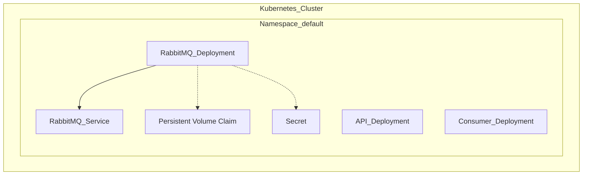
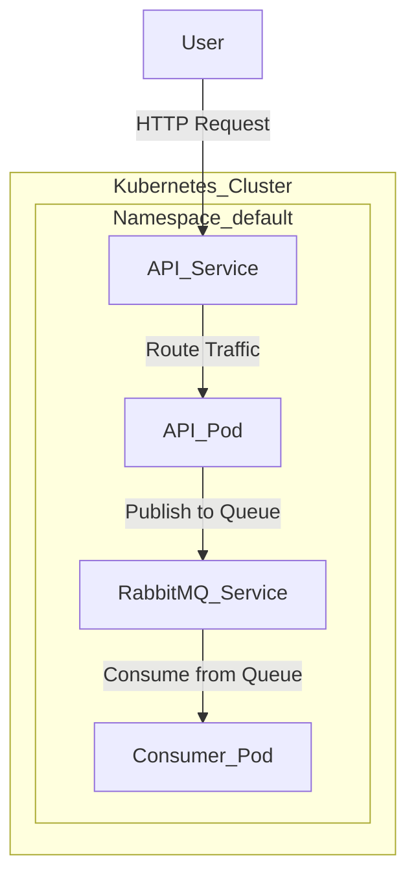

# Name Meaning System - Deployment Guide

This README provides detailed instructions to verify your Kubernetes cluster requirements, deploy the project, run tests, troubleshoot potential issues, and clean up resources. This project consists of a system to receive a name, find the meaning, publish it to a queue, and consume messages from RabbitMQ using Knative services.

## Table of Contents
- [Name Meaning System - Deployment Guide](#name-meaning-system---deployment-guide)
  - [Table of Contents](#table-of-contents)
  - [Requirements](#requirements)
    - [Verify Requirements](#verify-requirements)
  - [Deployment Steps](#deployment-steps)
    - [Deploy RabbitMQ](#deploy-rabbitmq)
    - [Deploy API Service](#deploy-api-service)
    - [Deploy Consumer Service](#deploy-consumer-service)
  - [Verify and Test Deployment](#verify-and-test-deployment)
    - [Verification](#verification)
    - [Testing the API](#testing-the-api)
    - [Testing End-to-End Functionality](#testing-end-to-end-functionality)
  - [Troubleshooting](#troubleshooting)
  - [Clean Up](#clean-up)
    - [Architecture Diagrams](#architecture-diagrams)
      - [Infrastructure Deployment Diagram](#infrastructure-deployment-diagram)
      - [Service Components and Communications Diagram](#service-components-and-communications-diagram)

## Requirements
Before deploying the Name Meaning System, ensure your cluster meets the following requirements:

- Kubernetes Cluster (v1.18 or higher)
- kubectl command-line tool (v1.18 or higher)
- Knative Serving installed
- Knative Eventing installed
- Persistent volume storage available for RabbitMQ
- Docker installed to build container images (or use a container registry)

### Verify Requirements
Run the following commands to verify that your cluster is ready:

```bash
# Check Kubernetes version
kubectl version --short

# Verify Knative Serving and Eventing components
kubectl get pods -n knative-serving
kubectl get pods -n knative-eventing
```
Ensure that all the pods in the Knative namespaces are running successfully.

## Deployment Steps
### Deploy RabbitMQ
1. **Create RabbitMQ Secret**:
   ```bash
   kubectl create secret generic rabbitmq-secret \
     --from-literal=username=guest \
     --from-literal=password=guest
   ```

2. **Deploy Persistent Volume Claim** for RabbitMQ data:
   ```yaml
   apiVersion: v1
   kind: PersistentVolumeClaim
   metadata:
     name: rabbitmq-pvc
   spec:
     accessModes:
     - ReadWriteOnce
     resources:
       requests:
         storage: 1Gi
   ```
   Apply the PVC:
   ```bash
   kubectl apply -f name-meaning-system/infrastructure/rabbitmq/rabbitmq-pvc.yaml
   ```

3. **Deploy RabbitMQ**:
   ```bash
   kubectl apply -f name-meaning-system/infrastructure/rabbitmq/deployment.yaml
   kubectl apply -f name-meaning-system/infrastructure/rabbitmq/service.yaml
   ```

### Deploy API Service
Deploy the API that handles name lookups:

```bash
kubectl apply -f name-meaning-system/api/k8s/service.yaml
```

### Deploy Consumer Service
Deploy the consumer that reads from RabbitMQ:

```bash
kubectl apply -f name-meaning-system/consumer/k8s/deployment.yaml
```

## Verify and Test Deployment
### Verification
1. **Check All Pods** are running:
   ```bash
   kubectl get pods
   ```
   Ensure that all pods, including RabbitMQ, API, and Consumer, are in a `Running` state.

2. **Check Services**:
   ```bash
   kubectl get svc
   ```
   Make sure all services are correctly exposed.

3. **Check Knative Services**:
   ```bash
   kubectl get ksvc
   ```
   Confirm that the Knative services are created and are `Ready`.

### Testing the API
To test the API, you can use the following command to call the `/lookup/{name}` endpoint:

```bash
# Replace <API_ENDPOINT> with the actual external IP or hostname
curl -X POST <API_ENDPOINT>/lookup/John
```

You should receive a response indicating that the name meaning has been processed and published to the queue.

### Testing End-to-End Functionality
After sending a request to the API, verify that the consumer is processing the messages by checking the consumer logs:

```bash
kubectl logs -l app=name-meaning-consumer
```

You should see a log indicating that the consumer received and processed the message.

## Troubleshooting
- **Pod Crashing**: Check the logs of any crashing pod:
  ```bash
  kubectl logs <pod-name>
  ```
  Ensure that all environment variables (e.g., `RABBITMQ_HOST`) are set correctly.

- **RabbitMQ Connection Issues**:
  Verify RabbitMQ services and pods:
  ```bash
  kubectl get svc rabbitmq
  kubectl get pods -l app=rabbitmq
  ```
  Ensure that RabbitMQ is running and accessible from the API and Consumer pods.

- **No Active Pods for Knative Service**: If the `name-lookup-api` pods are not created, it may be due to no traffic. Send a request to the service to trigger pod creation:
  ```bash
  curl -X POST <API_ENDPOINT>/lookup/John
  ```

- **Liveness and Readiness Probe Failures**: If the probes are failing, consider removing them or adjusting their configuration to allow more time for the application to become healthy. You can update the deployment YAML to remove or modify the `livenessProbe` and `readinessProbe` sections.

## Clean Up
To delete all deployed resources, run the following commands:

1. **Delete API and Consumer Services**:
   ```bash
   kubectl delete -f name-meaning-system/api/k8s/service.yaml
   kubectl delete -f name-meaning-system/consumer/k8s/deployment.yaml
   ```

2. **Delete RabbitMQ**:
   ```bash
   kubectl delete -f name-meaning-system/infrastructure/rabbitmq/deployment.yaml
   kubectl delete -f name-meaning-system/infrastructure/rabbitmq/service.yaml
   kubectl delete pvc rabbitmq-pvc
   ```

3. **Delete RabbitMQ Secret**:
   ```bash
   kubectl delete secret rabbitmq-secret
   ```

This will remove all components related to the Name Meaning System from your Kubernetes cluster.

### Architecture Diagrams

#### Infrastructure Deployment Diagram
The following diagram illustrates the infrastructure deployment of the Name Meaning System:



#### Service Components and Communications Diagram
The following diagram shows the service components and communications within the system:



These diagrams provide a visual overview of how the infrastructure and services are connected and how communication flows through the system.