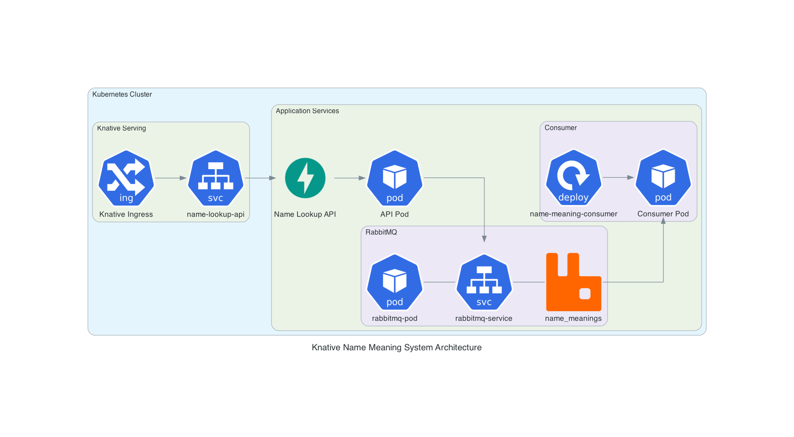

# Knative Name Meaning System

A production-ready cloud-native application that processes name meanings using Knative, RabbitMQ, and Python microservices. The system demonstrates event-driven architecture with auto-scaling capabilities.

## Table of Contents
1. [System Architecture](#system-architecture)
2. [Project Structure](#project-structure)
3. [Core Components](#core-components)
4. [Prerequisites](#prerequisites)
5. [Quick Start](#quick-start)
6. [Deployment Guide](#deployment-guide)
7. [Testing and Verification](#testing-and-verification)
8. [Monitoring and Troubleshooting](#monitoring-and-troubleshooting)
9. [Scaling and Performance](#scaling-and-performance)
10. [Cleanup and Maintenance](#cleanup-and-maintenance)

## System Architecture



The system leverages an event-driven architecture that includes:
- **Knative for serverless auto-scaling**
- **RabbitMQ for message queuing**
- **Python microservices for processing**

## Project Structure
```
name-meaning-system/
├── api/                      # Name Lookup API Service
│   ├── src/                  # API source code
│   │   └── main.py           # FastAPI application
│   ├── k8s/                  # Kubernetes manifests
│   │   └── service.yaml      # Knative service definition
│   ├── Dockerfile            # API container build
│   └── requirements.txt      # Python dependencies
├── consumer/                 # Name Meaning Consumer Service
│   ├── src/                  # Consumer source code
│   │   └── main.py           # RabbitMQ consumer
│   ├── k8s/                  # Kubernetes manifests
│   │   └── deployment.yaml   # Consumer deployment
│   ├── Dockerfile            # Consumer container build
│   └── requirements.txt      # Python dependencies
└── infrastructure/           # Infrastructure Components
    └── rabbitmq/             # RabbitMQ message broker
        ├── deployment.yaml   
        └── service.yaml
```

## Core Components

1. **API Service**: FastAPI-based Knative service that handles name lookup requests.
2. **Message Queue**: RabbitMQ instance for managing message delivery.
3. **Consumer Service**: Background worker that processes name meanings.

## Prerequisites

### Required Tools
- Kubernetes cluster (v1.20+)
- Knative Serving installed
- `kubectl` CLI
- Docker
- Python 3.8+

### Environment Setup
1. Install Python dependencies for each service:
   ```bash
   pip install -r api/requirements.txt
   pip install -r consumer/requirements.txt
   ```
2. Configure `kubectl` for your cluster.
3. Verify Knative installation:
   ```bash
   kubectl get pods -n knative-serving
   ```

## Quick Start

### Building Docker Images

```bash
# Build and push API Service
cd api
docker build -t your-registry/name-lookup-api:latest .
docker push your-registry/name-lookup-api:latest

# Build and push Consumer Service
cd ../consumer
docker build -t your-registry/name-meaning-consumer:latest .
docker push your-registry/name-meaning-consumer:latest
```

## Deployment Guide

### 1. Deploy RabbitMQ
```bash
kubectl apply -f infrastructure/rabbitmq/deployment.yaml
kubectl apply -f infrastructure/rabbitmq/service.yaml
```

### 2. Deploy API Service
```bash
kubectl apply -f api/k8s/service.yaml
```

### 3. Deploy Consumer Service
```bash
kubectl apply -f consumer/k8s/deployment.yaml
```

### 4. Verify Deployment
- **RabbitMQ**: `kubectl get pods -l app=rabbitmq`
- **API Service**: `kubectl get ksvc name-lookup-api`
- **Consumer**: `kubectl get pods -l app=name-meaning-consumer`

## Testing and Verification

### 1. Basic Health Check
Verify API health endpoint:
```bash
curl http://name-lookup-api.default.127.0.0.1.nip.io/
```

### 2. Send Test Messages
Send a request to lookup a name:
```bash
curl -X POST http://name-lookup-api.default.127.0.0.1.nip.io/lookup/Alice
```

Expected Response:
```json
{
  "status": "success",
  "message": "Name meaning published to queue",
  "name": "Alice",
  "meaning": "This is a simulated meaning for the name Alice"
}
```

### 3. Monitor System Components
- **Consumer Logs**: `kubectl logs -l app=name-meaning-consumer --follow`
- **Queue Status**:
  ```bash
  kubectl exec -it $(kubectl get pods -l app=rabbitmq -o jsonpath='{.items[0].metadata.name}') -- rabbitmqctl list_queues
  ```

## Monitoring and Troubleshooting

### RabbitMQ Status
```bash
kubectl describe pod -l app=rabbitmq
kubectl logs -l app=rabbitmq
kubectl exec -it $(kubectl get pods -l app=rabbitmq -o jsonpath='{.items[0].metadata.name}') -- rabbitmqctl list_queues
```

### API Service Status
```bash
kubectl get ksvc name-lookup-api
kubectl describe ksvc name-lookup-api
kubectl logs -l serving.knative.dev/service=name-lookup-api
```

### Consumer Status
```bash
kubectl describe deployment name-meaning-consumer
kubectl logs -l app=name-meaning-consumer
```

### Common Issues and Solutions
- **API Not Accessible**: Verify Knative service readiness and ingress configuration.
- **Consumer Connection Errors**: Ensure RabbitMQ service is running and network policies are correct.
- **Messages Not Processing**: Check consumer logs and RabbitMQ queue status.

## Scaling and Performance

### Knative Auto-scaling
- **API Service** automatically scales based on incoming traffic:
  - Scales to zero when idle.
  - Rapidly scales up based on concurrent requests.
  - Configurable parameters in `service.yaml`.

### Consumer Scaling
```bash
# Scale consumer replicas
kubectl scale deployment name-meaning-consumer --replicas=3
```

### RabbitMQ Performance Tuning
```bash
kubectl exec -it $(kubectl get pods -l app=rabbitmq -o jsonpath='{.items[0].metadata.name}') -- rabbitmqctl list_queues name messages consumers
kubectl exec -it $(kubectl get pods -l app=rabbitmq -o jsonpath='{.items[0].metadata.name}') -- rabbitmqctl list_channels
```

### Performance Testing
Run load test (requires `hey` tool):
```bash
hey -n 1000 -c 100 -m POST http://name-lookup-api.default.127.0.0.1.nip.io/lookup/TestName
```

## Cleanup and Maintenance

### Complete System Removal
```bash
kubectl delete -f infrastructure/rabbitmq/
kubectl delete -f api/k8s/
kubectl delete -f consumer/k8s/
```

### Maintenance Tasks

- **Update Images**:
  ```bash
  # Build and push new versions
  docker build -t your-registry/name-lookup-api:v2 api/
  docker build -t your-registry/name-meaning-consumer:v2 consumer/
  docker push your-registry/name-lookup-api:v2
  docker push your-registry/name-meaning-consumer:v2

  # Update deployments
  kubectl set image deployment/name-meaning-consumer consumer=your-registry/name-meaning-consumer:v2
  ```

- **Backup RabbitMQ**:
  ```bash
  # Export definitions
  kubectl exec -it $(kubectl get pods -l app=rabbitmq -o jsonpath='{.items[0].metadata.name}') -- rabbitmqctl export_definitions /tmp/definitions.json
  ```

